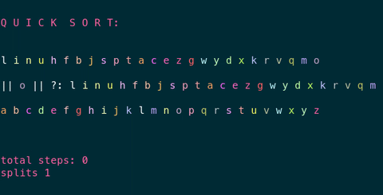
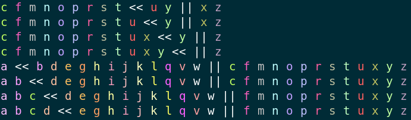

# Rainbow Sorts

### *A suite of colorful visualizations for commonly used sorting algorithms*
 

## Overview

Rainbow Sorts is a modest Node.js application built to offer a visual complement to instruction on sorting algorithms.

## Usage
Run `npm i` to install dependencies.

Then run `npm start` for directions or use `npm run SORT TIMEOUT OPTIONS`.

### Sort options
* `bubble`
* `insertion`
* `merge`
* `quick`

### Timeout
If the first command line argument after the sort is an integer, Rainbow Sorts will use this as the timeout in milliseconds. Default is 400ms.

### View options
* `wave`

### Input array options
* `words`
* `nums`

### Examples
* `npm run quick` : quickSort, 400ms timeout (default), letters array (default)
* `npm run bubble 180 nums` : bubble sort, 180ms timeout, number array
* `npm run merge 20 wave` : merge sort, 20ms timeout, letters array (default), wave view

## Views

The standard output shows each step in the sequence of the given sort algorithm with a standard delay of 400ms. This includes the name of each sort along with three colorized string representations of arrays: 1) the original array 2) the array or arrays currently being operated on by the sort, along with special symbols as dividers 3) the target array. 

Each algorithm also includes a `wave` option, which outputs the entire set of steps in order so that they can be reviewed sequentially.

## Dependencies

* [`regenbogler`](https://github.com/jeremyrrose/regenbogler)

