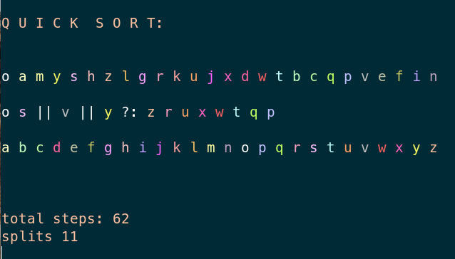

# Rainbow Sorts

### *A suite of colorful illustrations for commonly used sorting algorithms*

## Overview

Rainbow sorts is a Node.js application built to offer a visual complement to instruction on sorting algorithms.

The standard output shows each step in the sequence of the given sort algorithm with a standard delay of 400ms. This includes the name of each sort along with three colorized string representations of arrays: 1) the original array 2) the array or arrays currently being operated on by the sort, along with special symbols as dividers 3) the target array. 

Each algorithm also includes a `wave` option, which outputs the entire set of steps in order so that they can be reviewed sequentially.

